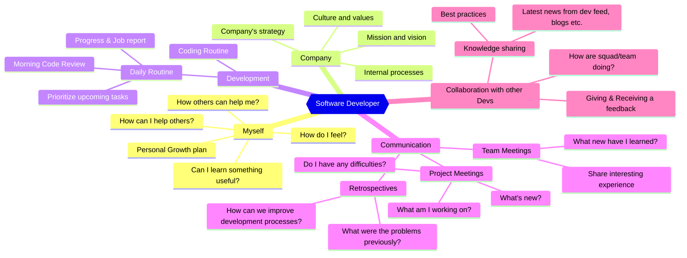

# Danil Morikov's Mind Card. 
## How do I introduce myself as a Software Developer.

```mermaid
mindmap
    root{{Software Developer}}
        Myself
            How do I feel?
            How can I help others?
            How others can help me?
            Can I learn something useful?

            Personal Growth plan

        Company
            Company's strategy
            Mission and vision
            Culture and values
            Internal processes

        Development

            Daily Routine
                Prioritize upcoming tasks
                Morning Code Review
                Progress & Job report

            Coding Routine
    
        Communication
            Project Meetings
                What's new?
                What am I working on?
                Do I have any difficulties?
            
            Team Meetings
                What new have I learned?
                Share interesting experience

            Retrospectives
                What were the problems previously?
                How can we improve development processes?

        Collaboration with other Devs
            Giving & Receiving a feedback

            Knowledge sharing
                Best practices
                Latest news from dev feed, blogs etc.

            How are squad/team doing?
```